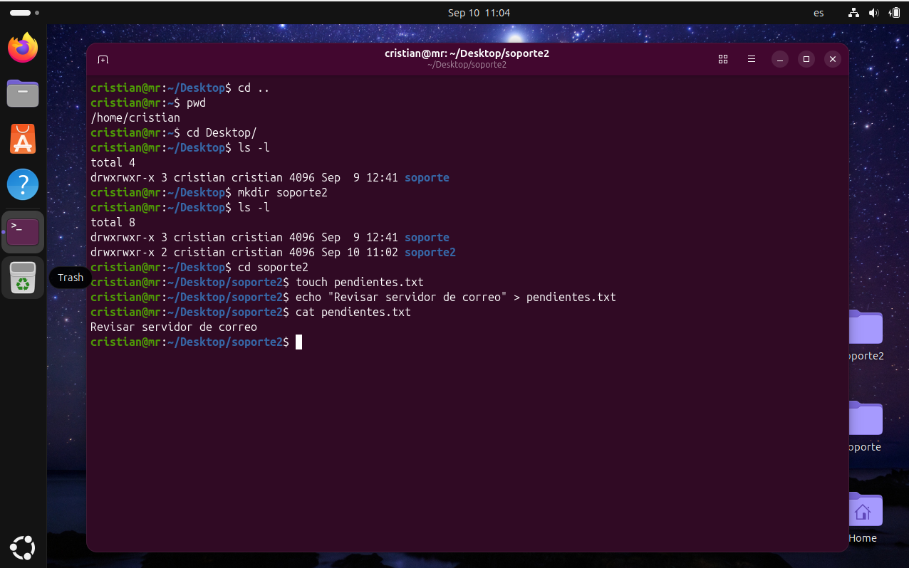

#Día 01: Navegación y creación de archivos y directorios.

## Objetivo/Escenario:
Familiarización de la terminal al navegar entre distintos directorios, determinar cuál es la ubicación actual del usuario, crear archivos con información. 

## Comandos ejecutados:

'''bash
# 1. Saber la ubicación actual
pwd
# 2. Navegar entre directorios
Cd / cd ..
# 3. Desglosar los directorios o archivos almacenados en un directorio 
Ls –l
# 4. Crear un directorio
Mkdir
# 5. Crear un archivo vacío 
Touch
# 6. Imprimir sobre la pantalla de la terminal una cadena de caracteres
Echo
# 7. Redirigir la salida de un comando hacia un archivo, reescribiendo su contenido
>
# 8. Imprimir sobre la pantalla de la terminal el contenido de un archivo
Cat

## Evidencia de salida:

