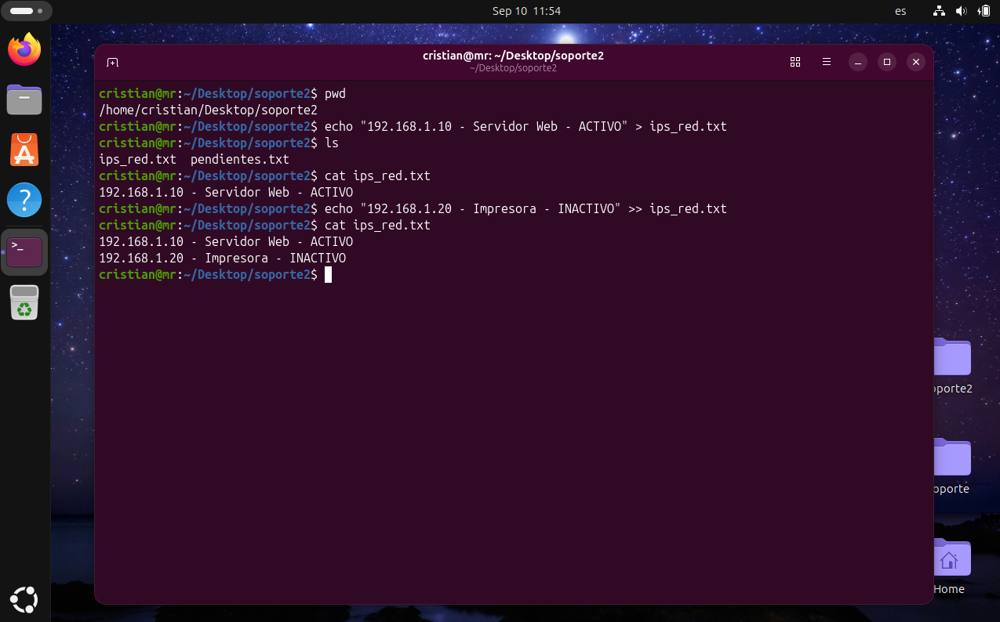

# Día 02: Modificación y copia de archivos.

## Objetivo/Escenario:
Agregar información a un archivo ya existente y respaldarlo para evitar perder información crucial. 

## Comandos ejecutados:

### 1. Saber la ubicación actual
pwd
### 2. Desglosar los directorios o archivos almacenados en un directorio 
Ls
### 3. Crear un archivo con contenido si es que el archivo no existe 
echo / ">"
### 4. Imprimir sobre la pantalla de la terminal el contenido de un archivo
Cat
### 5. Agregar información a un archivo sin eliminar el que ya poseía
">>"

## Evidencia de salida:

