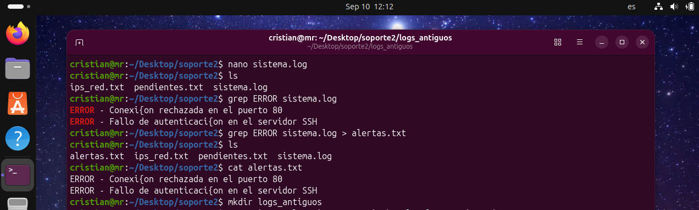
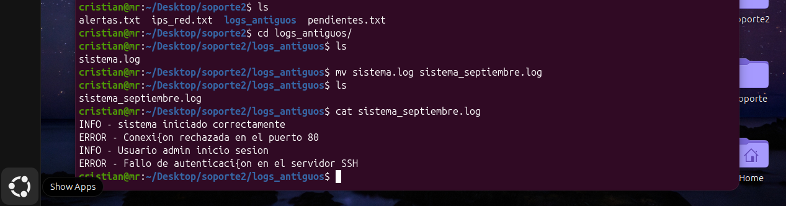

# Día 03: Filtrar y exportar información de un archivo 

## Objetivo/Escenario:
Usar el editor de texto "nano" para agregar información a un archivo.
Filtrar la información deseada para exportarla a un archivo nuevo para su fácil lectura. 

## Comandos ejecutados:

### 1. Crear un archivo.
nano sistema.log
### 2. Filtrar y buscar un texto o cadena de caracteres en un archivo. 
grep "Error" sistema.log
### 3. Exportar la búsqueda a un archivo nuevo
grep "ERROR" sistema.log > alertas.txt
### 4. Reorganizar archivos
mkdir logs_antiguos
mv sistema.log logs_antiguos/
mv sistema.log sistema_septiembre.log
### 5.- Verificar la información de un archivo
cat sistema_septiembre.log

## Evidencia de salida:

