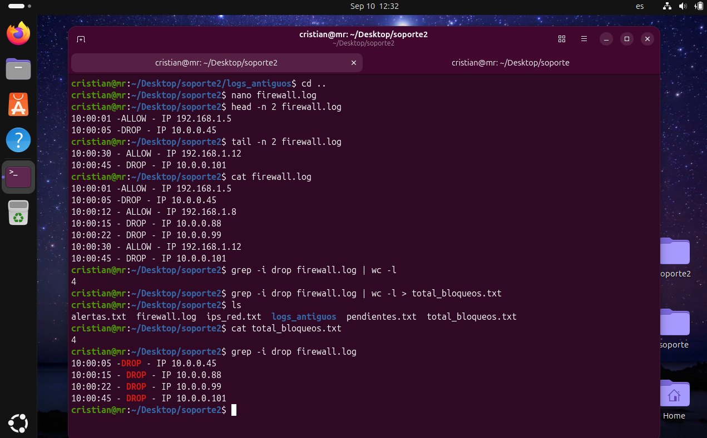

# Día 04: Filtrado con pipes y conteo de resultados 

## Objetivo/Escenario:
Imprimir en la terminal cierta cantidad de información de un archivo. Filtrar información de un archivo para crear otro que contenga el número de resultados. 

## Comandos ejecutados:

### 1. Crear un archivo.
nano firewall.log
### 2. Imprimir las primeras 2 líneas del archivo 
head -n 2 firewall.log
### 3. Imprimir las últimas 2 líneas del archivo 
tail -n 2 firewall.log
### 4. Filtrar del archivo firewall.log la palabra DROP y conectar esa salida con un pipe y obtener el número de resultados
grep -i "drop" firewall.log | wc -l
### 5. Crear un archivo con el resultado filtrado
grep -i "drop" firewall.log | wc -l > total_bloqueos.txt

## Evidencia de salida:

