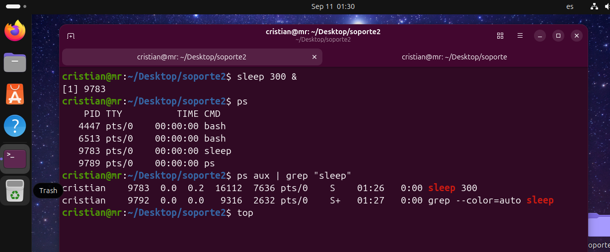
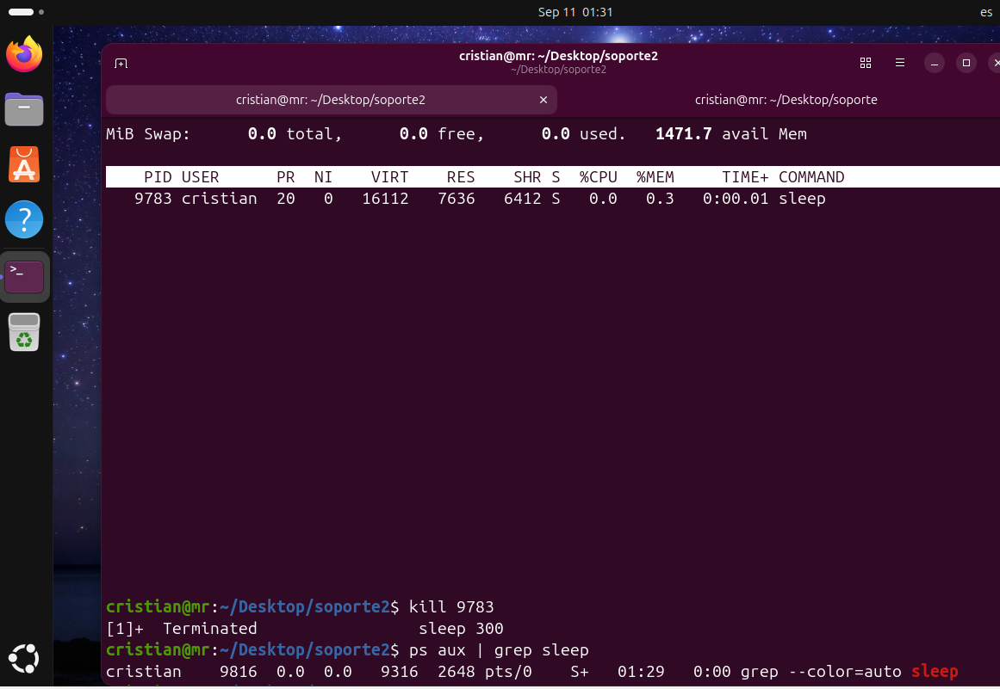

# Day 06: Desempeño del sistema y gestión de procesos
System Performance & Process Management

## Escenario/objetivo:
Monitorear los procesos que corren en el sistema, identificar y filtrar procesos por medio del PIDs, y detener exitosamente una tarea que no responde en background.

## Comandos ejecutados
### 1. Iniciar un proceso en background
sleep 300 &

### 2. Inspeccionar los procesos activos y filtrarlos por su nombre.
ps aux | grep sleep

### 3. Monitorear en tiempo real el CPU y la RAM.
top

### 4. Terminar el proceso utilizando el PID
kill <PID>

### 5. Verificar el proceso terminado
ps aux | grep sleep

## Evidencia

